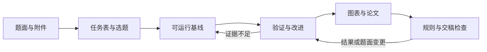

# Graduate Math Modeling Skill

面向研究生数学建模竞赛的中文 Codex Skill，覆盖选题、审题、模型与算法选择、Python/MATLAB 求解、结果验证、论文图表、摘要正文、模拟评审和交稿检查。当前版本为 **1.0.1**。

它服务于华为杯中国研究生数学建模竞赛、MathorCup 研究生组，以及研究生校赛和省赛。设计目标是帮助团队交付切题、可信、可复现、表达清楚的作品。它不承诺奖项，也不会把算法数量、图表数量或篇幅当成质量证明。

## 能做什么

- 用题面、附件、队伍能力、计算资源和剩余时间比较候选题，并给出限时原型与退出条件。
- 把每个小问落实为变量、目标或关系、约束、算法、验证方法和失败回退。
- 在预测、决策优化、综合评价、机理仿真、图网络、信号与图像任务之间选择合适路线。
- 建立从原始数据到结果、图表和论文主张的证据链，发现过期结果与口径冲突。
- 检查数据泄漏、约束可行性、最优性界、外推、敏感性、不确定性和论文数字一致性。
- 根据真实结果写摘要和正文，并按当届规则检查匿名、引用、AI 披露和最终文件。

## 快速使用

把本仓库放到 Codex 技能目录，并保证 `SKILL.md` 位于技能根目录。例如，目标目录可命名为：

```text
~/.codex/skills/grad-math-modeling/
```

随后在 Codex 中调用：

```text
$grad-math-modeling 这是赛题、附件和剩余时间。请先完成审题与选题比较，给出两小时内可验证的最小原型，并实际推进。
```

也可以只处理一个阶段：

```text
$grad-math-modeling 检查这个 MILP 线性化是否等价，给反例和小规模验证，不重建整个项目。
$grad-math-modeling 审查预测代码的数据泄漏、划分和指标口径，修复后重跑。
$grad-math-modeling 只根据现有结果文件改摘要，不能补造实验数字。
$grad-math-modeling 打开最终 PDF，按本届规则、匿名、图表和数字一致性做终审；不要代我提交。
```

首次使用可以运行原创合成练习：

```text
python scripts/make_demo.py examples/my-first-run --plot
```

完整项目可从轻量证据目录开始：

```text
python scripts/init_project.py <project-dir> --name "队伍练习" --mode practice --language python
```

已有工程无需重新初始化。技能会尽量适配已有代码、结果和目录。

## 工作流



技能按当前阶段加载少量参考资料，不会把所有算法和模板一次性塞进上下文。核心入口见 [SKILL.md](SKILL.md)，方法路由见 [references/model-routing.md](references/model-routing.md)，赛事边界见 [references/competition-rules.md](references/competition-rules.md)。

## 仓库结构

| 路径 | 内容 |
|---|---|
| `SKILL.md` | 技能入口、工作链和质量边界 |
| `references/` | 选题、算法路由、验证、图表、写作、规则和获奖案例卡 |
| `references/algorithms/` | 六类任务的算法选择卡 |
| `scripts/` | 初始化、实验记录、审计、冻结、绘图和演示工具 |
| `assets/` | 论文大纲与原创合成练习数据/代码 |
| `tests/` | 14 项本地集成测试和三组行为评测任务 |
| `dist/` | 可分发 `.skill` 包及逐文件哈希清单 |

## 验证状态

- 六个本地工具使用 Python 标准库实现；绘图另需 Matplotlib。
- 14 项集成测试已在 Python 3.12.7 下通过，覆盖真实子进程、失败状态、路径逃逸、非有限数值、过期证据和冻结文件变化。
- 原创三项目资源分配例题已经实际运行：完整枚举收益为 10，单位收益比贪心收益为 7；该结果只验证工作流，不宣传算法效果。
- 两组已完成的成对行为评测中，启用和不启用技能都通过全部 13 条断言，因此目前没有增量性能优势结论。

详细范围和限制见 [开发与验证说明](docs/DEVELOPMENT_AND_VALIDATION.md)。发布包 SHA-256 为 `f8287fbe4cd0a4d766f3852f7ba22ff0a80d742c9343ac88f384721805568cb8`。

运行测试：

```text
python tests/test_tools.py
```

## 研究依据与边界

设计过程核查了三套公开数学建模技能、华为杯和 MathorCup 官方材料，以及七篇身份可核实的公开获奖作品和一篇补充样本。仓库只保留方法卡、来源定位和原创实现，不包含原始论文、获奖表或第三方源码。来源和核验等级见 [references/sources.md](references/sources.md) 与 [references/source-catalog.json](references/source-catalog.json)。

赛事规则会变化。比赛期间必须重新核验本届主办方原文，尤其是 AI 使用、匿名、模板、附件和提交时间。历史获奖论文适合学习问题拆解、验证和表达方式，不能证明某种算法必然获奖，也不能复制成自己的成果。

## 责任与许可证

队员仍需负责理解题目、关键建模判断、结果核实、规则合规和最终提交。请勿上传未公开题目、个人数据或其他队伍作品到未获授权的服务，也不要隐瞒 AI 使用。

本仓库当前未附加开源许可证。公开可见不等于自动授予复制、修改或再分发权；如需开放这些权限，可以后续由仓库所有者选择合适的许可证。

